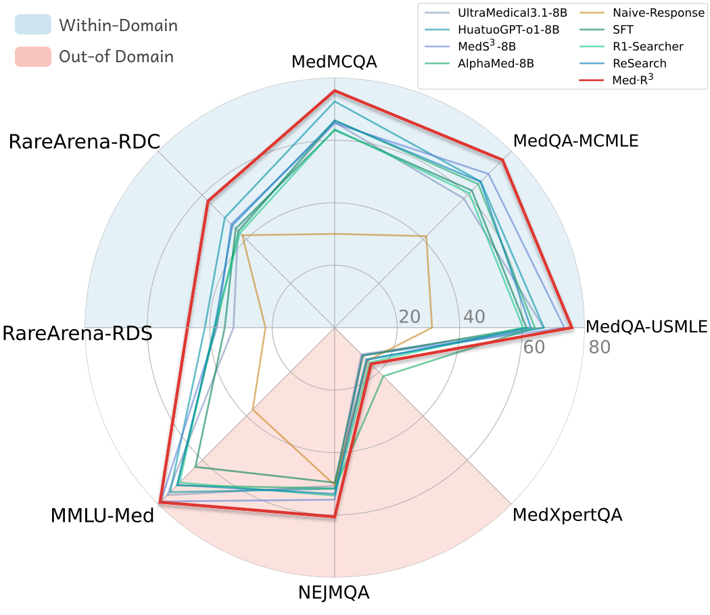

# <div align="center">Med-R$^3$: Enhancing Medical Retrieval-Augmented Reasoning of LLMs via Progressive Reinforcement Learning</div>

<div align="center">
<a href="https://arxiv.org/pdf/2507.23541" target="_blank"></a>
<a href="https://github.com/plageon/HierSearch/blob/main/LICENCE"></a>
<a></a>
</div>

Python implementation of ***Med-R$^3$***, a ***Med***ical ***R***etrieval-augmented ***R***easoning framework driven by progressive ***R***einforcement learning. We achieve improvements on open-source models including LLaMA ([LLaMA3.1-8B-Instruct](https://huggingface.co/meta-llama/Llama-3.1-8B-Instruct)) and Qwen ([Qwen2.5-7B](https://huggingface.co/Qwen/Qwen2.5-7B), [Qwen2.5-14B](https://huggingface.co/Qwen/Qwen2.5-14B)) series. Experiments indicate that the models trained with Med-R$^3$ significantly improve medical performances. Notably, LLaMA3.1-8B-Instruct + Med-R$^3$ surpasses the close-sourced proprietary model GPT-4o-mini by 3.93% at a comparable parameter scale, while Qwen2.5-14B integrated with Med-R$^3$ shows a more substantial gain of 13.53%.
The graphic below provides an overview of the training pipeline of Med-R$^3$.

<!--  -->


<!--  -->
<!-- ## Getting started -->

## 📦 Installation

Our implementation primarily builds upon [`verl`](https://github.com/volcengine/verl). Noted that we utilize `vllm==0.7.3`. 
<!-- To get started, please install the required packages: -->
<!-- ```bash
pip install -r ./myverl/verl/requirements.txt
``` -->

Install verl

`cd ./myverl/verl && pip install -e .`

Install my_reward

`cd ./myverl/my_reward && pip install -e .`


## 🎯 Data Construction
The scripts for data construction are in `./data_construction/`. 
The data preprocessing scripts for RL are located in the `./myverl/data_preprocess/` directory. These scripts generate the training data in Parquet format within the `./myverl/data/` directory, and the sample of constructed data for training is `./myverl/data/train/merged_med-multi_sample.parquet`.


***Note***: The class names used in the reward modeling phase are defined during the data preprocessing phase. Therefore, you need to replace the `reward_actor` names in the scripts located in `./myverl/data_preprocess/`.
```bash
"reward_actor": "RewardActorMedReasoningLogical" # "RewardActorMedReasoningLogical", "RewardActorMedReasoningLogical2", "RewardActorMedReasoningLogical3"
```

## ⚡ Verify Model Serving
```bash
export MY_REWARD_USE_TOOL=1
cd ./myverl/my_reward/my_reward && python server.py --port 80 --url "your URL" --model "model_name" --key EMPTY --max_tokens 4096 --temperature 0.6 --top_p 0.9
```

## 🚀 Training
The reinforcement learning (RL) framework is built upon [`verl`](https://github.com/volcengine/verl) with Group Relative Policy Optimization (GRPO) as the learning algorithm, while omitting the KL penalty and applying clip-higher and overlong penalty. 
For training, you can review and modify the relevant parameters in the following scripts.
```bash
cd ./myverl/
bash med_R3_grpo.sh # MedR3
bash med_grpo_baseline.sh # Vanilla RL (reasoning without retrieval)
```
Before starting the training, you should first:
- Deploy the verification model and enter its URL.  
- Provide the URL of the knowledge corpus.
```bash
export DIAGNOSIS_VERIFY_URL="xxx (the verify model's url)"

SEARCH_URL="xxx"
```


<!-- ## Experimental Results
Comparison of **Med-R$^3$** with baselines that utilize the **LLaMA3.1-8B-Instruct** as the backbone model.

 -->

## 🤝 Acknowledge

This implementation is mainly based on [***verl***](https://github.com/volcengine/verl). 
The model serving is based on [***SGLang***](https://docs.sglang.ai/). 
We also thank our previous work [***ReMEDY***](https://github.com/Aaawahe/ReMEDY) on enhancing the medical reasoning capabilities of LLMs via RL. 
We sincerely appreciate their contributions to the open-source community.

## 📜 Citation

```bibtex
@misc{lu2025medr3enhancingmedicalretrievalaugmented,
      title={Med-R$^3$: Enhancing Medical Retrieval-Augmented Reasoning of LLMs via Progressive Reinforcement Learning}, 
      author={Keer Lu and Zheng Liang and Youquan Li and Jiejun Tan and Da Pan and Shusen Zhang and Guosheng Dong and Huang Leng and Bin Cui and Wentao Zhang},
      year={2025},
      eprint={2507.23541},
      archivePrefix={arXiv},
      primaryClass={cs.CL},
      url={https://arxiv.org/abs/2507.23541}, 
}
```